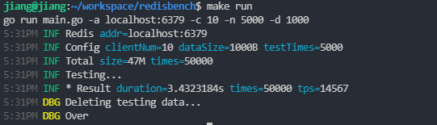
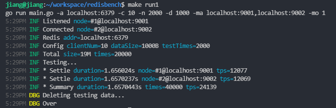
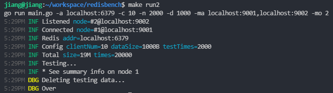

# Redis & Redis Cluster benchmark Tool

- Written in Golang
- Can test redis single instance
- Can test redis cluster
- Can take advantage of multi-core
- Supports running on multiple machines at the same time, for testing a large redis cluster (The same hardware of machines are needed for )

## Warning

Testing data keys named like `benchmark-set.*`, make sure they are not conflicting with your keys.

## Help

```console
$ ./redisbench -h
Usage of redisbench:
  -a string
        Redis instance address or Cluster addresses. IP:PORT[,IP:PORT]
  -c int
        Clients number for concurrence (default 1)
  -d int
        Data size in bytes (default 1000)
  -db int
        Choose a db, only for non-cluster (default 0)
  -ma string
        addresses for run multiple testers at the same time
  -mo int
        the order current tester is in multiple testers
  -n int
        Testing times at every client (default 3000)
  -p string
        The password for auth, only for non-cluster
```

## Example

```
go run main.go -a localhost:6379 -c 10 -n 5000 -d 1000
```



### Use multiple testing nodes

```sh
go run main.go -a localhost:6379 -c 10 -n 2000 -d 1000 -ma localhost:9001,localhost:9002 -mo 1
```



```sh
go run main.go -a localhost:6379 -c 10 -n 2000 -d 1000 -ma localhost:9001,localhost:9002 -mo 2
```

